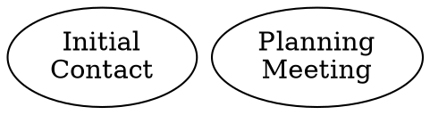
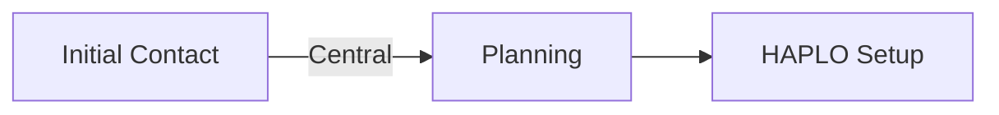

# LSBU Pre-Award Journey Planner - Code Analysis & Recommendations

## Executive Summary

The current GraphViz DOT code attempts to replicate a TfL tube map aesthetic but has several fundamental issues that prevent it from matching the reference design. The primary problems are: incorrect layout engine, lack of manual positioning, improper line routing, and missing visual elements.

---

## Critical Issues Requiring Immediate Attention

### 1. **Layout Engine - CRITICAL**
**Current:** `layout=neato`
**Problem:** The `neato` engine uses a spring-based force-directed algorithm designed for undirected graphs. This creates unpredictable, circular layouts that bear no resemblance to tube maps.

**Solution:**
- For tube map aesthetics, you need **manual positioning** with `pos` attributes for each node
- Alternative: Use `layout=dot` with heavy customization via `rank` and `rankdir` attributes
- Best approach: Use `neato` BUT with explicit `pos="x,y!"` coordinates for every node (the `!` prevents repositioning)

**Example:**
```dot
node [shape=circle, fixedsize=true, width=0.30, pos="1,5!", style=filled, fillcolor="white"];
initial_contact [pos="0,5!"];
planning_meeting [pos="2,5!"];
```

---

### 2. **Node Positioning - CRITICAL**
**Current:** No positioning specified
**Problem:** Nodes will be randomly distributed by the spring algorithm

**Solution:**
Create a coordinate grid system matching your image:
- Horizontal axis represents timeline (Week 1-6)
- Vertical axis represents different process tracks
- Each station needs explicit `pos="x,y!"` coordinates

**Recommended approach:**
```dot
// Timeline: 0-6 (representing weeks)
// Vertical tracks: 0-5 (different process lines)

initial_contact [pos="0,3!"];
planning_meeting [pos="1,3!"];
budget_scope [pos="0.5,1!"];
partner_details [pos="0,0!"];
```

---

### 3. **Line Routing & Shared Segments - HIGH PRIORITY**
**Current:** Each line is completely independent
**Problem:** In tube maps, multiple lines often share the same route segment (e.g., Central and Metropolitan lines both use `internal_review → case_for_support → draft_proposal`)

**Current code duplicates these connections:**
```dot
// Central Line
internal_review -- case_for_support;
case_for_support -- draft_proposal;

// Metropolitan Line
draft_start -- internal_review;
internal_review -- case_for_support;  // DUPLICATE
case_for_support -- draft_proposal;   // DUPLICATE
```

**Problem:** GraphViz will overlay these edges, not render them as parallel lines like a real tube map.

**Solution Options:**
1. **Accept single-line rendering** for shared segments (simplest)
2. **Use invisible helper nodes** to create parallel routing
3. **Switch to D3.js/SVG** for full control over line rendering
4. **Use edge bundling** with careful port specifications

**Example with helper nodes:**
```dot
case_for_support_central [label="Case for Support", pos="3,3!"];
case_for_support_metro [label="", shape=point, width=0, pos="3.1,2.9!"];

// Central line uses main node
internal_review -- case_for_support_central [color="#E32017"];

// Metro line uses offset helper
internal_review -- case_for_support_metro [color="#9B0056"];
case_for_support_metro -- draft_proposal [color="#9B0056"];
```

---

### 4. **Station Labels & Typography - MEDIUM PRIORITY**
**Current:** Labels are embedded in nodes with `label=` attribute
**Problem:** In TfL maps, station names appear OUTSIDE the station circle, often at angles

**Reference image shows:**
- Small circles (ticks/dots) for stations
- Station names positioned externally
- Angled text for some stations
- Different label positions (above, below, left, right)

**Solution:**
```dot
node [shape=circle, label="", width=0.15];  // Smaller circles, no internal label

initial_contact [xlabel="Initial\nContact"];  // External label
planning_meeting [xlabel="Planning\nMeeting"];

// For positioning control, you may need HTML-like labels:
initial_contact [
    label=<<TABLE BORDER="0"><TR><TD>Initial Contact</TD></TR></TABLE>>,
    shape=plaintext
];
```

**Note:** GraphViz has limited support for rotated text. For true tube map aesthetics, consider:
- SVG post-processing
- D3.js implementation
- Inkscape manual editing

---

### 5. **Interchange Stations - HIGH PRIORITY**
**Current:** No visual distinction for interchange stations
**Problem:** Stations like "Submission", "Final Approvals", "Ethics Approval" are connection points for multiple lines but look identical to regular stations

**Reference image shows:**
- Interchange stations have multiple colored ticks/markers
- Lines visibly intersect or run parallel through interchanges

**Solution:**
```dot
// Option 1: Larger nodes for interchanges
submission [width=0.25, style=filled, fillcolor="white", penwidth=2];

// Option 2: Multiple colored borders (not well supported in dot)
submission [color="#E32017:#00782A:#9B0056", penwidth=3];

// Option 3: Use clusters/subgraphs
subgraph cluster_submission {
    style=invisible;
    submission [label="Submission"];
}
```

**Best approach:** Manual SVG editing after GraphViz generation, OR use D3.js/canvas

---

### 6. **Timeline Header - MEDIUM PRIORITY**
**Current:** No timeline representation
**Problem:** The reference image shows "Week 1, Week 2, ..., Week 6" headers

**Solution:**
```dot
// Add invisible nodes at the top to create week markers
week1 [shape=plaintext, label="Week 1", pos="0,6!"];
week2 [shape=plaintext, label="Week 2", pos="1,6!"];
week3 [shape=plaintext, label="Week 3", pos="2,6!"];
week4 [shape=plaintext, label="Week 4", pos="3,6!"];
week5 [shape=plaintext, label="Week 5", pos="4,6!"];
week6 [shape=plaintext, label="Week 6", pos="5,6!"];

// Connect with invisible edges to maintain spacing
week1 -- week2 -- week3 -- week4 -- week5 -- week6 [style=invis];
```

---

### 7. **Background Elements - LOW PRIORITY**
**Current:** None
**Reference image shows:**
- Grey vertical dividers between weeks
- "Thames" label and blue area
- Background grid/zones

**Solution:**
```dot
graph [
    bgcolor="white",
    // Add background layers
];

// Use clusters for background zones
subgraph cluster_thames {
    label="Thames";
    style=filled;
    fillcolor="#E0F2FE";
    pre_submission; peer_review; // Nodes in this zone
}
```

**Note:** GraphViz has limited support for complex backgrounds. Consider:
- SVG post-processing
- Layering in Inkscape/Illustrator
- Using HTML/CSS overlay

---

### 8. **Edge Routing & Splines - MEDIUM PRIORITY**
**Current:** `splines=true`
**Problem:** Default spline routing creates curved edges that don't match tube map aesthetic

**TfL tube maps use:**
- Horizontal, vertical, and 45° diagonal segments
- Right-angle bends
- Controlled curves

**Solution:**
```dot
graph [
    splines=ortho,  // Orthogonal (right-angle) routing
    // OR
    splines=polyline,  // Straight line segments
];

// For specific edge control:
edge [
    dir=none,  // No arrowheads
    constraint=true
];
```

**Testing required:** Experiment with:
- `splines=ortho`
- `splines=polyline`
- `splines=line`
- Manual edge routing with `pos` attribute

---

### 9. **Color Accuracy - LOW PRIORITY**
**Current:** Uses official TfL colors ✓
**Status:** **CORRECT** - Well done!

Colors match TfL branding:
- Central Line: `#E32017` (red) ✓
- District Line: `#00782A` (green) ✓
- Piccadilly Line: `#0019A8` (blue) ✓
- Circle/Northern: `#FFD300` (yellow) ✓
- Metropolitan: `#9B0056` (magenta) ✓

---

### 10. **Node Styling - MEDIUM PRIORITY**
**Current:** `width=0.30` with filled white circles
**Problem:** In the reference image, stations appear as small tick marks or dots, not large circles

**Solution:**
```dot
node [
    shape=circle,
    width=0.12,  // Much smaller
    height=0.12,
    fixedsize=true,
    style=filled,
    fillcolor="white",
    color="black",  // Border color
    penwidth=1.5
];

// For interchange stations
submission [width=0.18, penwidth=2.5];
```

---

## Recommended Implementation Strategy

### Option A: Pure GraphViz (Limited fidelity)
**Difficulty:** Medium
**Fidelity:** 60-70%
**Advantages:** Simple, text-based, version-controllable
**Disadvantages:** Limited visual control, manual positioning required

**Steps:**
1. Add explicit `pos="x,y!"` coordinates for all nodes
2. Use `splines=ortho` or `splines=polyline`
3. Add timeline header nodes
4. Reduce node sizes
5. Use external labels (`xlabel`)
6. Accept limitations (no parallel lines, simple interchanges)

### Option B: GraphViz + SVG Post-Processing
**Difficulty:** Medium-High
**Fidelity:** 85-90%
**Advantages:** Best of both worlds
**Disadvantages:** Two-step process

**Steps:**
1. Generate base layout with GraphViz
2. Export to SVG
3. Edit in Inkscape/Illustrator to add:
   - Parallel line segments
   - Angled labels
   - Background elements
   - Timeline grid

### Option C: D3.js / Canvas (Recommended for production)
**Difficulty:** High
**Fidelity:** 95-100%
**Advantages:** Full control, interactive potential, responsive
**Disadvantages:** Requires JavaScript development

**Implementation:**
- Use D3.js force simulation with constraints
- Manual coordinate system
- SVG rendering with full control over:
  - Line routing (Bézier curves, polylines)
  - Station symbols
  - Labels (positioned, rotated)
  - Interchanges (multi-line symbols)

**Example libraries:**
- [D3.js](https://d3js.org/)
- [mermaid.js](https://mermaid-js.github.io/) (with custom theming)
- [Cytoscape.js](https://js.cytoscape.org/)

### Option D: HTML/CSS Grid (Alternative approach)
**Difficulty:** Medium
**Fidelity:** 70-80%
**Advantages:** Responsive, accessible, web-native
**Disadvantages:** Line routing is complex in CSS

**Implementation:**
- CSS Grid for positioning
- SVG for line paths
- HTML elements for stations

---

## Immediate Next Steps (Prioritized)

### Priority 1: Fix Layout Engine


### Priority 2: Create Positioning Map
Create a coordinate mapping document:

| Station | X (Week) | Y (Track) | Notes |
|---------|----------|-----------|-------|
| Initial Contact | 0 | 5 | Start of Central Line |
| Budget Scope | 0.5 | 1 | Finance track |
| Partner Details | 0 | 0 | Partnerships track |
| ... | ... | ... | ... |

### Priority 3: Reduce Node Sizes
```dot
node [
    width=0.12,
    height=0.12,
    xlabel=""  // Move labels outside
];
```

### Priority 4: Test Edge Routing
Experiment with:
```dot
graph [splines=ortho];    // Test 1
graph [splines=polyline]; // Test 2
graph [splines=line];     // Test 3
graph [splines=curved];   // Test 4
```

### Priority 5: Add Timeline
```dot
week1 [shape=plaintext, label="Week 1", pos="0,6!"];
week2 [shape=plaintext, label="Week 2", pos="2,6!"];
// ... etc
```

---

## Alternative Technologies to Consider

If GraphViz proves too limiting, consider:

### 1. **Mermaid.js** (Markdown-based)

- Easier syntax
- Good for simple diagrams
- Limited styling control

### 2. **PlantUML** (UML-based)
- Better for timeline diagrams
- Gantt chart support
- Activity diagram mode

### 3. **Draw.io / Excalidraw**
- Manual drawing
- Full control
- Not code-based (harder to version control)

### 4. **Custom SVG/Canvas**
- Ultimate control
- Steep learning curve
- Best for production web deployment

---

## Conclusion

The current code is a **good conceptual foundation** but requires:

1. **Mandatory:** Add manual positioning (`pos` attributes)
2. **Mandatory:** Reduce node sizes
3. **High priority:** Fix line routing (splines setting)
4. **High priority:** Add timeline header
5. **Medium priority:** Distinguish interchange stations
6. **Medium priority:** Move labels outside nodes

**Realistic expectations:**
- Pure GraphViz will achieve ~70% visual fidelity to the reference
- For production-quality tube map aesthetics, consider D3.js or SVG post-processing
- The current approach is excellent for rapid prototyping and iteration

**Recommended path forward:**
1. Fix positioning and layout (1-2 hours)
2. Test visual output
3. Assess if GraphViz limitations are acceptable
4. If not, transition to D3.js implementation (1-2 days development)

---

## Sample Improved Code Snippet

```dot
graph LSBU_PreAward_Tube {
    graph [
        bgcolor="#F9FAFB",
        layout=neato,
        overlap=false,
        splines=polyline,
        sep=0.5
    ];

    node [
        shape=circle,
        fixedsize=true,
        width=0.12,
        height=0.12,
        style=filled,
        fillcolor="white",
        fontname="Arial",
        fontsize=8,
        penwidth=1.5
    ];

    edge [
        dir=none,
        penwidth=2.4
    ];

    // Timeline Headers
    week1 [shape=plaintext, label="Week 1", pos="0,6!", fontsize=10];
    week2 [shape=plaintext, label="Week 2", pos="2,6!", fontsize=10];
    week3 [shape=plaintext, label="Week 3", pos="4,6!", fontsize=10];

    // Central Line (Core Approvals) - Red
    initial_contact [pos="0,5!", xlabel="Initial\nContact"];
    planning_meeting [pos="1.5,5!", xlabel="Planning\nMeeting"];
    haplo_setup [pos="2.5,5!", xlabel="HAPLO\nSetup"];
    submission [pos="10,5!", xlabel="SUBMISSION", width=0.20, penwidth=3];

    // Finance Track - Blue
    budget_scope [pos="0,2!", xlabel="Budget\nScope"];
    budget_planning [pos="1.5,2!", xlabel="Budget\nPlanning"];
    draft_costs [pos="3,2!", xlabel="Draft\nCosts"];

    // Connections - Central Line
    edge [color="#E32017"];
    initial_contact -- planning_meeting -- haplo_setup;

    // Connections - Finance
    edge [color="#0019A8"];
    budget_scope -- budget_planning -- draft_costs;
}
```



Save this, render with:
```bash
neato -Tsvg journey_planner.dot -o journey_planner.svg
```

Then open in a browser or Inkscape for review.
