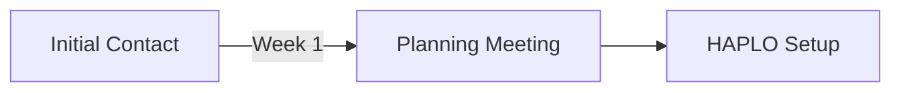

# LSBU Pre-Award Journey Planner - TfL Tube Map Style

## 📁 Files in This Directory

1. **journey_planner.dot** - Original code (with issues)
2. **journey_planner_improved.dot** - Improved version with manual positioning
3. **JOURNEY_PLANNER_ANALYSIS.md** - Detailed technical analysis and recommendations

## 🚀 Quick Start

### Rendering the Graph

If you have GraphViz installed:

```bash
# Install GraphViz (if not already installed)
# Ubuntu/Debian:
sudo apt-get install graphviz

# macOS:
brew install graphviz

# Windows: Download from https://graphviz.org/download/

# Render the improved version to SVG
neato -Tsvg journey_planner_improved.dot -o journey_planner.svg

# Render to PNG
neato -Tpng journey_planner_improved.dot -o journey_planner.png -Gdpi=300

# Render to PDF
neato -Tpdf journey_planner_improved.dot -o journey_planner.pdf
```

### Online Visualization

If you don't have GraphViz installed, use these online tools:

1. **GraphvizOnline** - https://dreampuf.github.io/GraphvizOnline/
   - Copy/paste the code from `journey_planner_improved.dot`
   - Select "neato" as the engine
   - Click render

2. **Graphviz Visual Editor** - http://magjac.com/graphviz-visual-editor/
   - More interactive
   - Live preview

## 📊 Key Improvements in `journey_planner_improved.dot`

### ✅ What's Fixed

1. **Manual Positioning** - All nodes have explicit `pos="x,y!"` coordinates
2. **Timeline Headers** - Week 1-6 markers added at top
3. **Smaller Nodes** - Reduced from 0.30 to 0.12 width (more tube-like)
4. **External Labels** - Using `xlabel` to position labels outside circles
5. **Interchange Stations** - Larger nodes with thicker borders for key connection points
6. **Improved Spacing** - Better visual hierarchy and track separation
7. **Polyline Routing** - Straighter edges (changed from curved splines)

### ⚠️ Known Limitations (GraphViz constraints)

1. **No Parallel Lines** - Lines that share the same route segment will overlap (not run parallel)
2. **Label Rotation** - Cannot rotate labels to 45° angles like real tube maps
3. **Background Elements** - Limited support for zones, Thames area, week dividers
4. **Interchange Symbols** - Cannot create multi-colored tick marks for interchanges
5. **Curved Routing** - Limited control over exact line paths

## 🎨 Color Scheme (Official TfL Colors)

| Line | Name | Color | Hex Code |
|------|------|-------|----------|
| Central | Core Approvals Journey | Red | `#E32017` |
| District | Partnerships & Due Diligence | Green | `#00782A` |
| Piccadilly | Finance & Costing | Blue | `#0019A8` |
| Northern/Circle | Ethics & Governance | Yellow | `#FFD300` |
| Metropolitan | Proposal Development | Magenta | `#9B0056` |

## 🗺️ Journey Planner Structure

### Process Tracks (Vertical Positioning)

- **y=5** - Central Line (Core Approvals Journey)
- **y=4** - Ethics Track
- **y=3.5** - Proposal Development
- **y=3** - Tech Support
- **y=2.5** - Finance Track
- **y=1** - Partnerships Track

### Timeline (Horizontal Progression)

- **x=0-2** - Week 1: Initial contact, planning, setup
- **x=2-4** - Week 2: Budget planning, due diligence
- **x=4-6** - Week 3: HAPLO, portal, internal review
- **x=6-8** - Week 4: Case for support, draft proposal
- **x=8-10** - Week 5: Review, approvals
- **x=10-12.5** - Week 6: Final approvals, submission

### Interchange Stations

These stations connect multiple lines:
- **Submission** - Central + District + Metropolitan
- **Final Approvals** - Central + Piccadilly + Metropolitan
- **Ethics Approval** - Central + Northern/Circle
- **Internal Review** - Central + Metropolitan
- **Draft Proposal** - Central + Metropolitan

## 🔧 Customization Guide

### Adjusting Node Positions

Edit the `pos="x,y!"` attribute:

```dot
// Format: pos="x_coordinate,y_coordinate!"
// The ! prevents GraphViz from repositioning

initial_contact [pos="0,5!", xlabel="Initial\nContact"];
//                   ↑  ↑
//                   x  y
```

### Changing Node Sizes

```dot
// Default station
node [width=0.12, height=0.12];

// Interchange station
submission [width=0.25, penwidth=3.5];
```

### Adding New Stations

```dot
// 1. Define the node with position
new_station [pos="4.5,3!", xlabel="New\nStation"];

// 2. Connect it to existing nodes
edge [color="#E32017"];
previous_station -- new_station -- next_station;
```

### Modifying Colors

```dot
// Change line color
edge [color="#FF0000"]; // Any hex color
station1 -- station2;

// Change node fill
node [fillcolor="#E0F2FE"]; // Light blue background
```

## 📈 Next Steps for Production Quality

### Option 1: SVG Post-Processing (Recommended for print)

1. Generate SVG: `neato -Tsvg journey_planner_improved.dot -o output.svg`
2. Open in Inkscape or Adobe Illustrator
3. Manually add:
   - Parallel line segments
   - Rotated labels
   - Background zones (Thames, week dividers)
   - Legend
   - LSBU branding

### Option 2: D3.js Implementation (Recommended for web)

Convert to an interactive web visualization:
- Responsive design
- Hover tooltips for station details
- Clickable stations linking to process documentation
- Animated journey paths
- Mobile-friendly

**Example libraries:**
- D3.js - https://d3js.org/
- Cytoscape.js - https://js.cytoscape.org/
- vis.js - https://visjs.org/

### Option 3: Mermaid.js (Simpler alternative)



Less control but easier to embed in documentation.

## 🎯 Use Cases

### For Researchers
- Visual guide to grant application process
- Identify parallel workstreams
- Understand dependencies and interchanges
- Timeline planning

### For RAD Team
- Onboarding new researchers
- Process documentation
- Training materials
- Website resource

### For Project Management
- Track application progress
- Identify bottlenecks
- Resource planning
- Gantt chart alternative

## 🐛 Troubleshooting

### Graph looks messy/overlapping
- Ensure all nodes have `pos` attributes with `!` suffix
- Increase `sep` value in graph attributes
- Use `overlap=false`

### Labels are cut off
- Increase `pad` value in graph attributes
- Use shorter labels or `\n` line breaks
- Adjust graph canvas size

### Lines don't connect properly
- Check node names match exactly (case-sensitive)
- Verify edge color is set before drawing edge
- Use `dir=none` to remove arrowheads

### Cannot render
- Verify GraphViz is installed: `dot -V`
- Check for syntax errors (missing semicolons, brackets)
- Try different engines: `dot`, `neato`, `fdp`, `circo`

## 📝 Version History

- **v1.0** (Original) - Basic structure, no positioning
- **v2.0** (Improved) - Manual positioning, timeline, improved aesthetics

## 🤝 Contributing

To improve this journey planner:

1. Test rendering with different GraphViz engines
2. Refine station positions for better visual flow
3. Add missing stations or tracks
4. Create alternative output formats (HTML, PDF, PNG)
5. Develop D3.js web version

## 📧 Contact

For questions or improvements, contact:
**LSBU Research Awards & Development (RAD)**
Email: papa@lsbu.ac.uk

## 📚 Resources

- **GraphViz Documentation** - https://graphviz.org/documentation/
- **TfL Design Standards** - https://tfl.gov.uk/corporate/about-tfl/what-we-do/design-for-london
- **Tube Map Design History** - https://en.wikipedia.org/wiki/Tube_map
- **DOT Language Guide** - https://graphviz.org/doc/info/lang.html

---

**Last Updated:** 2025-11-30
**Author:** LSBU D x D Research Team
